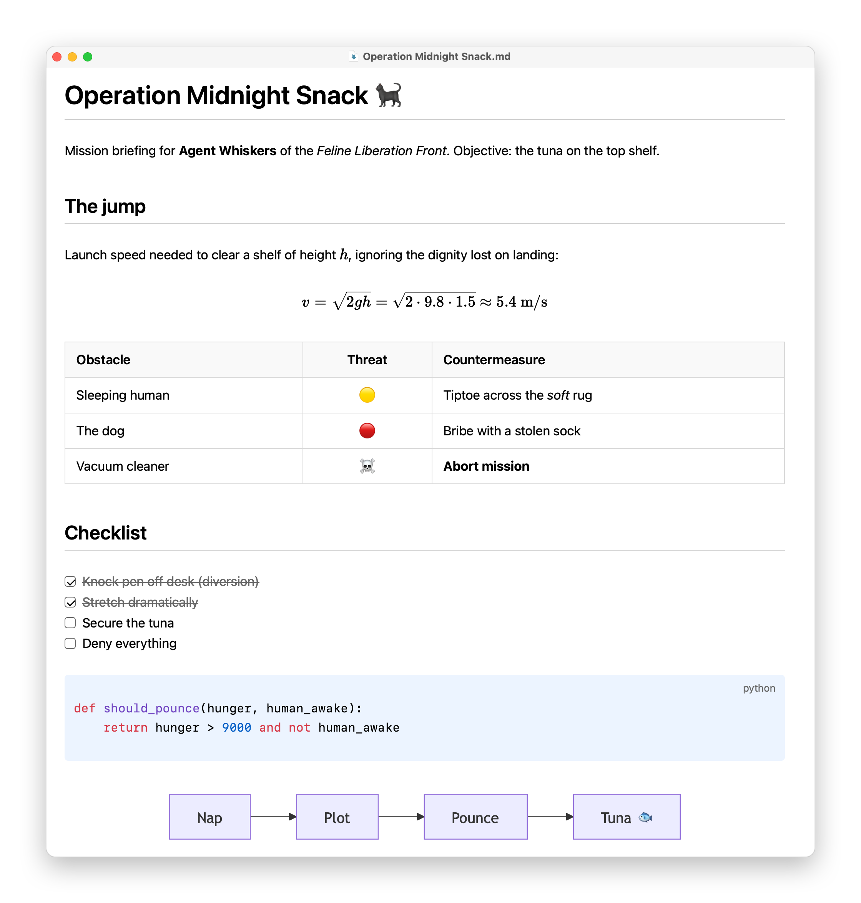

# Margin

Simple Mac Markdown viewer and editor. Edit with live rendering, Obsidian-style. 

## Install

Download the latest `Margin-x.y.z.zip` from the [Releases](../../releases) page, unzip it and move Margin to Applications. Runs on Apple Silicon and Intel Macs with macOS 13 or later.

## License

[MIT](LICENSE). Third-party notices for bundled packages are generated into `dist/ThirdPartyNotices.txt` and included in the app.
