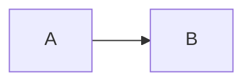

# A real Markdown document

Unicode: café, naïve, 中文, 🦊. **Bold**, *italic*, ~~done~~, `code`.

## Links and lists

[A reference](https://commonmark.org "CommonMark") and a literal <script>alert('no')</script>.

- [ ] Pending
- [x] Finished
  - Nested item

> A quotation.

| Name | Value |
| --- | --- |
| alpha | 1 |

```js
const untouched = '**not bold**';
```

Inline $x^2$ and display math:

$$
\int_0^1 x\,dx = \frac{1}{2}
$$


